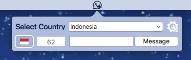
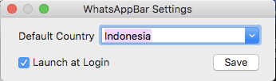
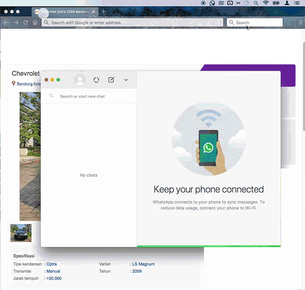

# WhatsAppBar

Little sweet addition to your [WhatsApp Desktop](https://itunes.apple.com/us/app/whatsapp-desktop/id1147396723?mt=12). on your Mac.

## What is WhatsAppBar

WhatsAppBar helps you to send WhatsApp messages to someone who is not on your contact list. You don't need to save the number first to start chatting.

If you mostly use [WhatsApp Desktop](https://itunes.apple.com/us/app/whatsapp-desktop/id1147396723?mt=12) on MacOS and want to start chatting with someone but too lazy to add the number to your phonebook, you're going to love this app.

## How To Use
**WhatAppBar** stay on your menubar,run the apps and start chat with anyone from your OSX menubar..

Select the country and input the number to start chat. 

###Preferences Menu
Click gear icon to go into preference windows

## Requirement
* macOS High Sierra (10.13.4)
* [WhatsApp Desktop](https://itunes.apple.com/us/app/whatsapp-desktop/id1147396723?mt=12)
* Active WhatsApp on your phone

## DMG File
You can download DMG file [here](http://bit.ly/2IROVQK)

## How It Looks

## License

All contents of this repository are licensed under a [Beerware License](https://en.wikipedia.org/wiki/Beerware) 

<aldychris@gmail.com> wrote this file. As long as you retain this notice you can do whatever you want with this stuff. 

If we meet some day, and you think this stuff is worth it you can buy me a beer in return or consider buying me a [coffee](https://ko-fi.com/aldychris)  

